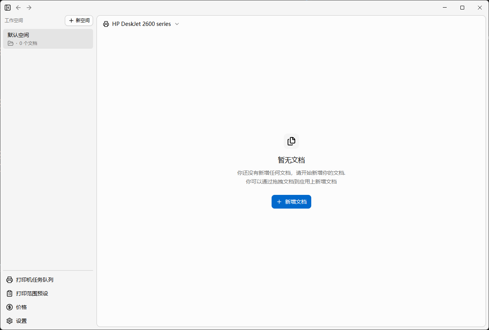
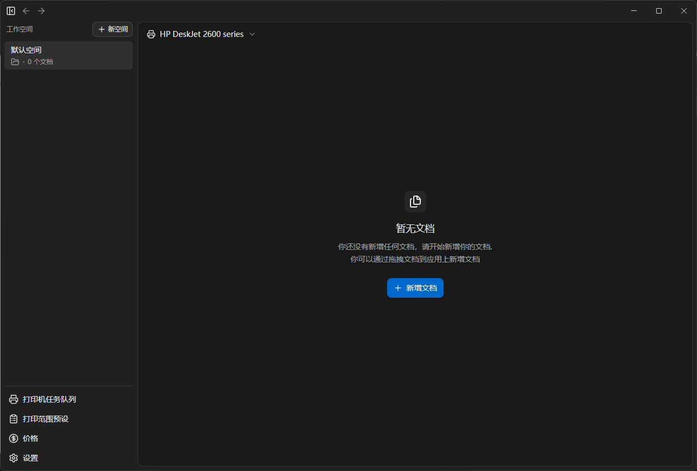

  

  <h3 align="center">Ym Printer</h3>

  

    ym-printer 是一款专门为喷墨打印机做的打印桌面应用。
     
     
    <a href="https://gitee.com/yxingyus/ym-printer/releases">
    Gitee
    </a>
    &middot;
    <a href="https://github.com/2514765066/ym-printer">
    Github
    </a>
    &middot;
    <a href="https://github.com/2514765066/ym-printer/blob/main/docs/release-note.md">
    更新内容
    </a>
  

## 功能与优势

简洁的UI设计、高效的打印效率、计算打印价格、支持导入doc，docx，wps，pdf、快速预览文档内容

## 界面展示

亮色主题展示

暗色主题展示

## 打印配置

**备注**：给当前文档添加备注（选填）

**打印机**：选择输出到的打印机（必填）

**打印份数**：当前文档打印的份数（范围：1-999）

**打印模式**：控制打印范围的解析（必选）

- 单打：单面打印，打印范围中的页全部单打
- 双打：双面打印，打印范围中的页全部双打
- 混合：混合打印，单独的数字代表单面打印，范围代表双面打印
- 混合(范围连接)：混合打印，单独的数字代表单面打印，范围代表双面打印，范围中间没有单独的数字会合并范围

**打印范围**：控制文档的打印范围（选填，不填默认是"-"）

- 单独的数字表示页（例如：1，2，3，4）
- 用"-"连接的代表范围（例如：1-4，1-，-，-5）
  1.  "-"前没有数字会自动补成"1-"。
  2.  "-"后没有数字会自动补成"1-最后一页"（例如一个文档是23页，"1-"就会变成"1-23","-"就会变成"1-23"）。

**墨盒颜色**：打印文档的墨盒颜色（必选）

**方向**：打印文档的方向（必选）

## 打印范围解析案例

单打：范围内所有内容都单面打印 
双打：范围内所有内容都双面打印 
混合：单独的数字单打，范围双打，范围直接用逗号隔开范围分离 
混合(范围连接)：单独的数字单打，范围双打，范围直接用逗号隔开范围合并 

> 逗号用中英文都可以 
> 其中0表示空白页 
> 范围表达式："" = "-" = "1-" 

### "-"，假如当前文档的页数是5页

单打解析结果：1，0，2，0，3，0，4，0，5，0 
双打解析结果：1，2，3，4，5，0 
混合解析结果：1，2，3，4，5，0 
混合（范围连接）解析结果：1，2，3，4，5，0 

### "1，2-"，假如当前文档的页数是5页

单打解析结果：1，0，2，0，3，0，4，0，5，0 
双打解析结果：1，2，3，4，5，0 
混合解析结果：1，0，2，3，4，5 
混合（范围连接）解析结果：1，0，2，3，4，5 

### "1，2-4，5-"，假如当前文档的页数是7页

单打解析结果：1，0，2，0，3，0，4，0，5，0，6，0，7，0 
双打解析结果：1，2，3，4，5，6，7，0 
混合解析结果：1，0，2，3，4，0，5，6，7，0 
混合（范围连接）解析结果：1，0，2，3，4，5，6，7 
